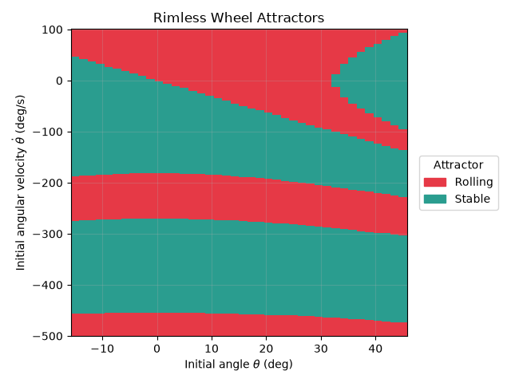
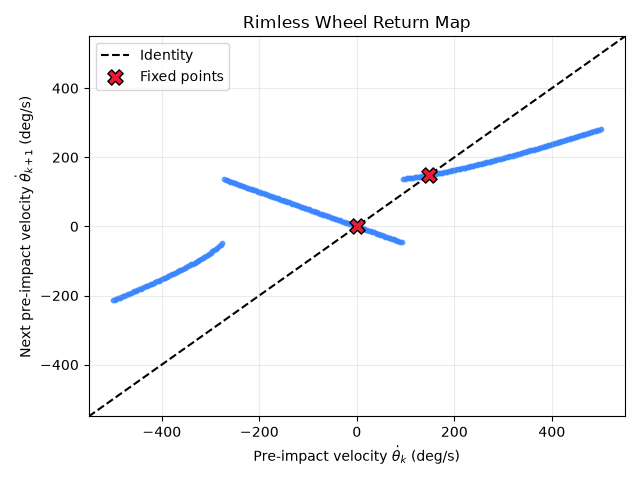
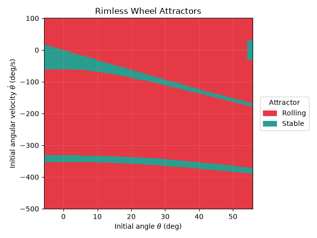
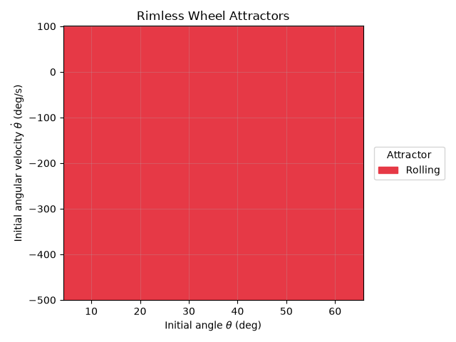
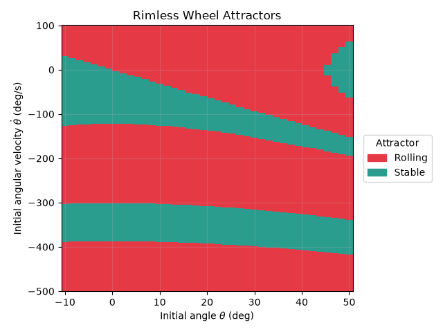
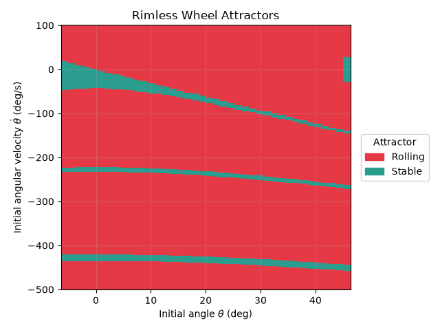
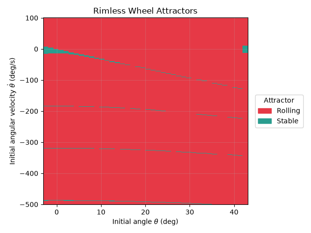

## Running

```bash
$ uv run assignment_1.py --help
usage: assignment_1.py [-h]
                       {attractors,trajectory,return,sweep-inclinations,sweep spokes} ...

Simulate the rimless wheel

positional arguments:
  {attractors,trajectory,return,sweep-inclinations,sweep-spokes}
    attractors          plot the attractor map
    trajectory          plot a single simulation
    return              plot the return map
    sweep-inclinations  sweep inclinations and save plots
    sweep-spokes        sweep spoke count and save plots

options:
  -h, --help            show this help message and exit
```

There are 5 subcommands. `trajectory` produces a plot of the angle and system energy over time. Parameters are the ones predefined in `models/rimless_wheel.py`. `attractors` and `return` plot the RoA and return map respectively for the same system. `sweep-inclinations` and `sweep-spokes` produce RoA and return maps and also print any fixed points found and their associated Floquet multipliers. A `results` folder must exist to store the result plots.

## Details

### Initial experiments

I implemented the rimless wheel as a discrete-time dynamical system that internally uses a provided integrator to integrate the continuous time pendulum dynamics. I included $\theta$, $\dot{\theta}$, and also $h$ in my state, where $h$ is the absolute height of the reference frame attached to the spoke currently on the ground. This is useful as an event guard and for calculating energy, which is one of the initial experiments I ran.

First, I wanted to look at the conservation of angular momentum, as we are supposed to have momentum-conserving plastic collisions. I was surprised to see that this doesn't happen:


Parameters: $l = 1, m = 1, \text{spokes} = 6, \gamma = 20\text{deg}, \theta_0 = 0, \dot{\theta}_0 = 1\text{deg/s}$

But actually, this makes sense. We should only expect angular momentum to be conserved in a constant reference frame, but we are moving the reference frame on each collision and I did not account for this in my angular momentum calculation.

To get a better idea of whether the system was behaving correctly, I made an energy plot that *does* account for the global position of the wheel (in addition to the angle and velocity of the pendulum). As expected, total energy is constant while the "pendulum" is swinging since there is no damping, and we lose energy only during plastic collisions.

I also added the ability for the wheel to go backwards. I expected it (in some cases) to roll backwards before settling into no motion (though in a simulation we may expect it to just go back and forth between "standing on" one leg and the other). This is what we see:


Parameters: $l = 1, m = 1, \text{spokes} = 6, \gamma = 20\text{deg}, \theta_0 = 0, \dot{\theta}_0 = -100\text{deg/s}$

Somewhat confident this was working correctly, I moved on.

### Regions of Attraction


Parameters: $l = 1, m = 1, \text{spokes} = 6, \gamma = 15\text{deg}$

Here, the "rolling" attractor is a limit cycle and the "stable" attractor is a fixed point (more specifically, where the wheel is just standing, not rolling). I determine which attractor each rollout falls into by

1. Looking at the final angular velocity. If it is sufficiently small, I mark it as "Stable"
2. Looking at the change in angular velocity from right before the second-to-last collision to right before the last collision. If it is sufficiently small, I mark it as "Rolling"
3. If neither condition is met, I mark it as "unknown" to avoid misclassifying trajectories. We can see that this never happened in the above rollouts.

The details of this map is further discussed in "Impact of Slope".

### Return Map


Parameters: $l = 1, m = 1, \text{spokes} = 6, \gamma = 15\text{deg}$
Fixed-point estimates: \[8.16523829e-04 1.48815857e+02\] deg/s
Floquet multipliers: \[-0.49237753  0.24408315\]

Fixed points were found by first estimating zero crossings from the sampled points and then narrowing it down using the [Bisection Method](https://en.wikipedia.org/wiki/Bisection_method). I’m not sure how valuable this is—I only added it because I initially thought some error in the fixed point could mess with the Floquet multipliers.

Once the fixed points are found, I estimate their Floquet multipliers by sampling points around them and fitting a line. This works because, formally speaking, the Floquet multipliers are the eigenvalues of the linearized Poincare map:
$$
\begin{align}
\text{let } P(x^\star) &= x^\star \\
P(x + \delta x) &\approx P(x) + \left. \frac{\partial P}{\partial x} \right|_{x} \delta x \\
P(x^\star + \delta x) &\approx x^\star + \left. \frac{\partial P}{\partial x} \right|_{x^\star} \delta x \\
\end{align}
$$
Then, in the 1-D case, $y(\delta x) = x^\star + \left. \frac{\partial P}{\partial x} \right|_{x^\star} \delta x$ is a line and $\frac{\partial P}{\partial x}$ , which is a 1x1 matrix, is its slope. Since the eigenvalue of a 1x1 matrix is just its value, estimating the slope of $y(\delta x)$ gives us the Floquet multiplier. We sample a few points to get a more accurate estimate (since numerical simulation can add some "noise").

### Impact of Slope

I tried a system with 6 spokes, a mass of 1, and rod length of 1 on 15, 25, 35, 45, and 55 degree inclines. Here are some of the RoAs:

15 degrees:


25 degrees:


35 degrees:


45 and 55 degrees look similar to 35 degrees.

Let's first analyze the 15 degree case. Generally, above the 0 deg/s line, as the initial velocity increases the system is more likely to roll forever. Rolling also becomes more common as the start angle increases: at 0 deg/s, a -10 deg start angle means the wheel will likely just roll backwards once and get stuck, but any angle causing the wheel to roll forwards (e.g. 10 deg) causes it to roll forever.

This continues to a point. Perhaps surprisingly, at 0deg/s and a 40deg start angle, the wheel eventually settles. The intuition is that we are actually giving the "pendulum" very little energy in these states: it starts very close to the angle at which the next spoke would hit the slope and isn't able to gain enough speed to keep going. A 15deg start angle has more potential energy because the wheel's mass is higher up. Giving more kinetic energy by increasing angular velocity "fixes" this.

This region looks symmetric over 0deg/s, though, which implies adding backwards velocity also helps. We also observe bands of stable and rolling final states as we further decrease the angular velocity. These regions of stable initial conditions within a sea of unstable conditions are states where the wheel had just enough speed to roll backwards a few times but *not* enough to keep rolling forward after that. If we look at the trajectories, we can see that each band corresponds to a certain number of times rolling backwards.

(40deg, 0deg/s): (0 backwards steps)


(40deg, -150deg/s): (1 backwards step)


(40deg, -350deg/s): (2 backwards steps)


**Finally, we can explain the changes we are seeing as slope increases.** In the 25deg plot, these bands retained their rough shape but got much smaller. Because the slope is higher, it is able to pull the wheel down out of more states. At the extreme (i.e. near 90deg), we would expect there to be *no* initial states in which the wheel would stop after moving backwards. Note that this *also* looks true at 35 degrees---the entire plot is red. However, this may be an artifact of resolution: if we zoomed in or increased our vertical resolution, we may still see bands.

Let's now also look at how slope impacts Floquet multipliers.

| Inclination | Floquet multiplier of rolling fixed point |
| ----------- | ----------------------------------------- |
| 15.0        | 0.24408315                                |
| 25.0        | 0.25189715                                |
| 35.0        | 0.25683313                                |
| 45.0        | 0.25391643                                |
| 55.0        | 0.25411112                                |

It appears to not impact it at all. Recalling our equation from before:
$$
P(x^\star + \delta x) \approx x^\star + \left. \frac{\partial P}{\partial x} \right|_{x^\star} \delta x
$$
If our Floquet multiplier is 0.25, whatever delta we have from the fixed point $x^\star$ will be multiplied by 0.25 each time we pass through the Poincare section. So if we start at $x^\star + \delta x$:
$$
x^\star + \delta x \rightarrow x^\star + 0.25 \delta x + 0.0625 \delta x \rightarrow ...
$$
The smaller the multiplier is, the less steps through the poincare section we need to converge. Note that this *doesn't* tell us anything about how much *time* it takes to converge.

So the inclination does not change how many steps (literally) the wheel needs to take to approach the final steady state.

### Impact of Spoke Count

I simulated spoke counts 6-12. Here are the return maps for the first three at 20 degrees:

6 spokes:


7 spokes:


8 spokes:


We see a somewhat similar effect to increasing the slope where the stable bands get smaller. This could be because, with higher spoke counts, the angle between spokes gets smaller. This means two things:

1. The wheel loses less kinetic energy at each step. In the limit, it loses none: $\lim_{\alpha \rightarrow 0} \dot{\theta}_{k + 1} = \lim_{\alpha \rightarrow 0} \dot{\theta}_k \cos(2 \alpha) = \dot{\theta}_k$. This makes it easier to keep spinning.
2. Intuitively, coming out of a step, the pendulum has to do a lot less swinging against gravity (it needs less kinetic energy to make it over $\theta = 0$ to being with).

We can also see that the bands seem to get closer together as we add more spokes. As we established previously, each band corresponds to some number of steps backwards before settling. It makes sense that wheels with more spokes would take more steps for the same backwards angular velocity.

Now, looking at the Floquet multipliers:

| Spokes | Floquet multiplier of rolling fixed point |
| ------ | ----------------------------------------- |
| 6      | 0.24880647                                |
| 7      | 0.38702394                                |
| 8      | 0.49912602                                |
| 9      | 0.58879527                                |
| 10     | 0.6577774                                 |
| 11     | 0.70720165                                |
| 12     | 0.74901064                                |

The spoke count seems to increase the Floquet multiplier, meaning we take more steps to converge the more spokes we add.
