# Assignment 2

## Running

```bash
$ uv run assignment_2.py --help
usage: assignment_2.py [-h] {trajectory,roa,return-map,lookup-table,...

Simulate the inverted pendulum walker

positional arguments:
  {trajectory,roa,return-map,lookup-table,initial-state-steps}
    trajectory          animate a trajectory and plot its energy
    roa                 plot the upright controller's region of attraction
    return-map          plot the theta=0 Poincare return map
    lookup-table        compute minimum steps to the ankle controller's RoA...
    initial-state-steps
                        plot estimated steps to stability over the full...

options:
  -h, --help            show this help message and exit
```

You can configure parameters for each of these subcommands in `assignment_2.py`.
If you want to run the resulting controller, first run

```bash
uv run assignment_2.py roa
uv run assignment_2.py lookup-table
```

And then run

```bash
uv run assignment_2.py trajectory --controller lookup \
    --map-file output/assignment_2/policy_map.npy \
    --roa-bounds-file output/assignment_2/roa_bounds.npy
```

### Using an accelerator

The code is written in JAX, so you may use an accelerator if you wish. You can run

```bash
uv sync --extra gpu
```

To install JAX with CUDA 13 -- JAX will then use your GPU by default. However, I
have made sure that all subprograms run in a reasonable time (at most a few minutes
on my machine) with just the CPU, so this is not necessary to get the results in
this write up.

## Sketches

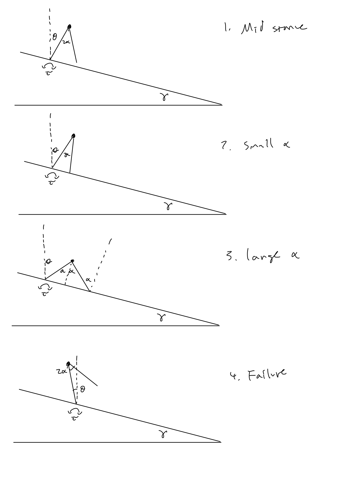

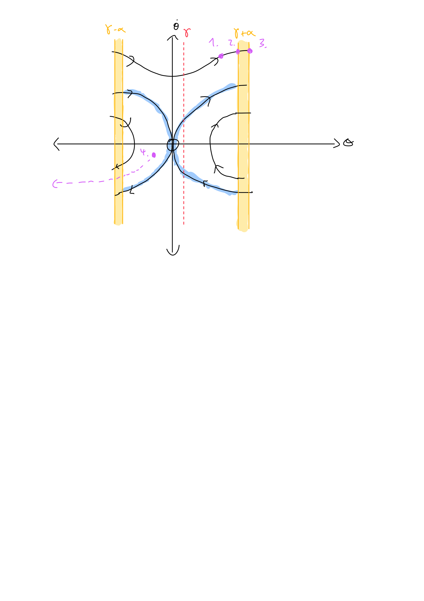

The locations of all four sketches on the state space plot are shown in pink.
The bounds (which vary based on $\alpha$) are shown in yellow. $\gamma$ shifts
both the upper and lower bound to the right. The size of the yellow bands is not
necessarily to scale with the sketches.

## RoA of ankle controller

The ankle torque is controlled via feedback linearization. We apply torque to
remove the effects of gravity and pendulum damping, and then add the same dynamics
with _inverted_ gravity so the pendulum behaves as if it is hanging down.

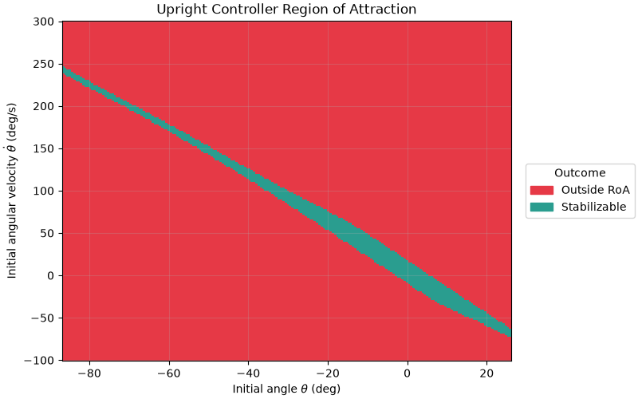

The ankle torque controller's region of attraction. Blue states are states which
the controller could stabilize the pendulum. We sweep
$\theta \in [-\frac{\pi}{2} + \gamma, \alpha + \gamma]$.
$\alpha = \frac{\pi}{8}$ for this plot. We terminate the trajectory immediately
if walker collides in either direction, as we are only interested in the RoA
within one step here. Note that the event dynamics do not handle collisions
backwards: we just manually check if the angle is beyond the backwards collision
bound.

## Poincaré section

I chose $\theta = 0$ as my Poincaré section. It is constant (unlike the
collision angle), allows us to use only $\dot{\theta}$ as the return map state
(since $\theta$ is fixed), and is transverse to all flows except those where
the pendulum has _just_ enough energy to stop at upright unstable equilibrium
(the blue highlighted ones in the below image). We do not really care about these
orbits, however, as they will stabilize anyways.

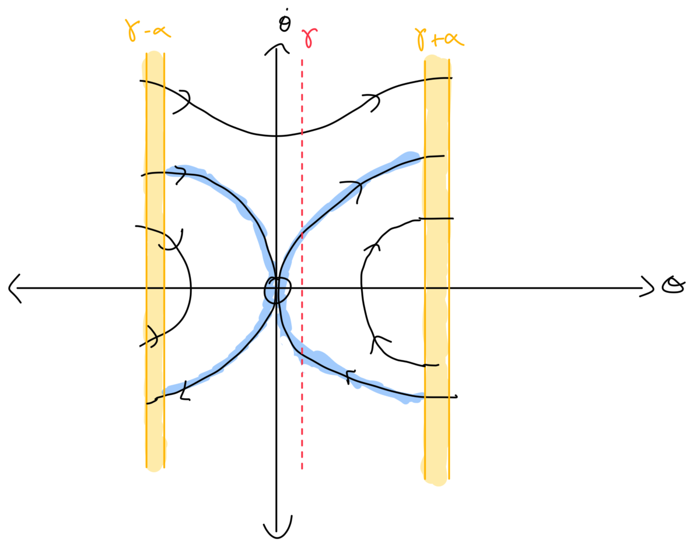

## Grid resolution

For the control lookup table grid, let's first see what happens with a very low
resolution. A good way to check how well we are doing is to compare what we
_think_ will happen based on our discretized state grid and transitions to what
actually happens. If we use just 4 uniform alpha values and 10 uniform $\dot{\theta}$
values, we get this plot:

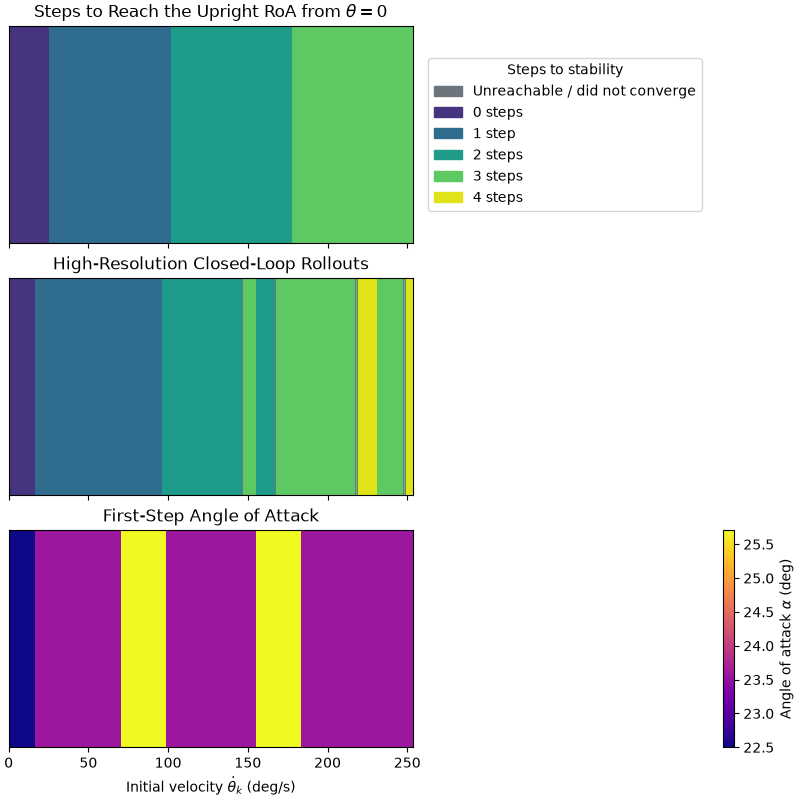

The first plot shows how many steps we expect each of the 10 possible start states
to take based only on the state transition graph. If the resolution is too low,
we may expect the number of steps in this graph to sometimes be wrong. For example,
if a given initial velocity $\dot{\theta}_0$ ended up at $\dot{\theta}_1$ the next
time it hit the Poincaré section, but we rounded it down to the closest state
$\dot{\theta}' < \dot{\theta}_1$, we may think that we can stop faster than we can
in reality. The second plot is what _actually_ happens if we roll out the controller,
and it is much higher resolution than the first plot (though this is hard to show).
In this case, we are rolling out 2000 initial velocities spaced evenly. We can see
that we had to take _more_ steps than we predicted (for example, at the first
light green band) in some cases. This implies our $\dot{\theta}$ resolution is
too low.

Indeed, if we increase our resolution to 40, these issues seem to mostly disappear.
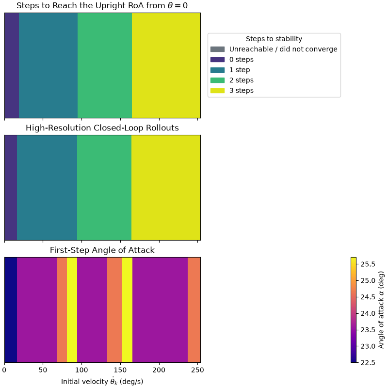

But at 35, they are still there.

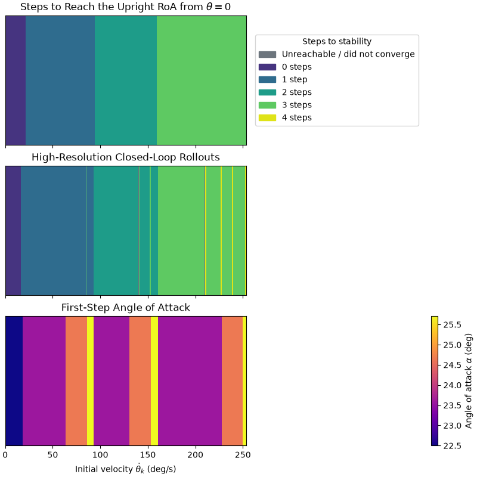

What about the resolution of alpha? This surprisingly doesn't seem to matter
_too_ much, but choosing an extremely low value (like restricting the controller
to only 2 alphas but still with 40 $\dot{\theta}$) can still cause problems.

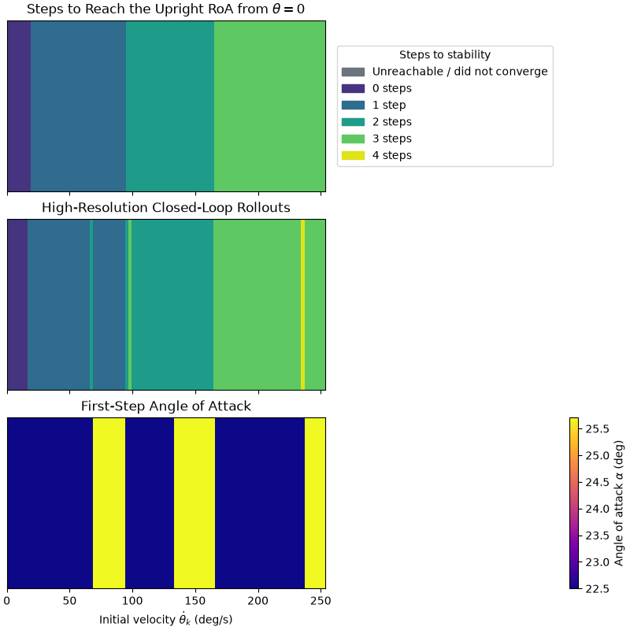

This is probably because the alpha selected for a given discretized $\dot{\theta}$
worked for that particular $\dot{\theta}$ but may not work for every continuous
state that corresponds to the discretized state. When choosing the $\alpha$ to use,
we intentionally select the median of the $\alpha$s that "work" (move us to a state
with the lowest possible already computed number of steps to convergence). This
gives us some robustness to this issue as the median $\alpha$ should somewhat work
for $\dot{\theta}$ higher or lower than the representative, but if there are very
few options for $\alpha$ that work then this is not very effective, and that is what
we are seeing here.

## Trajectory plot

Here is a trajectory with initial state $\theta = -0.1$, $\dot{\theta} = 3.0$. Note
that $\theta = -0.1$ was selected so the walker passes through the Poincaré section
and the correct $\alpha$ is selected.

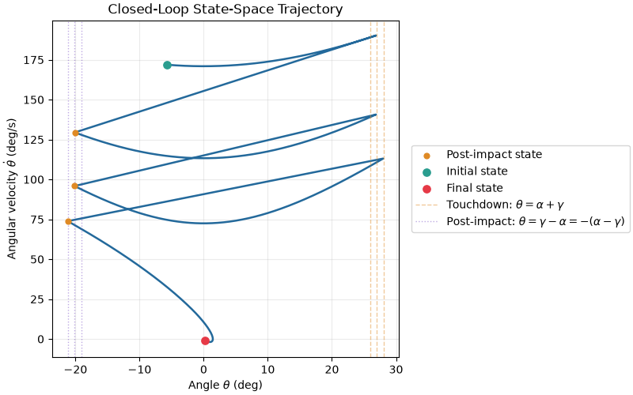

We can find the maximum number of steps we can take before converging to the RoA
by always setting the $\alpha$ to the minimum. Note that there may be some initial
conditions for which this _doesn't_ work: it's hypothetically possible to have
too much energy to stay in the RoA at one step but too little to make it to the
RoA in the next. However, if setting $\alpha$ to the minimum _does_ happen to
converge, we can guarantee that it is the maximum number of steps we can take before
we first enter the RoA since the minimum $\alpha$ results in the least energy loss.
For the initial condition I picked, this works, and tells us we can take at most
4 steps.

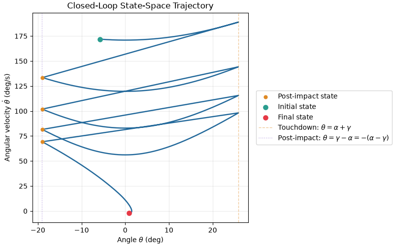

## Steps to standstill

We can look at a map over the whole state space of how many steps it takes to get
to the RoA. The earlier plots in "Grid resolution" are essentially 1D vertical
slices of this plot.

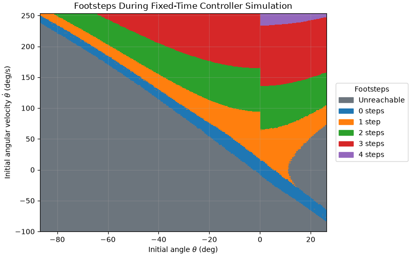

This was produced with the controller with 40 theta dot values and 4 alpha values.
The $\theta = 0$ slice should look pretty familiar if you compare it to the
previous plots. The "0 steps" section looks
_kind of_ like the RoA but not exactly, and it has small spots of "unreachable".
These are both likely caused by the fact that this controller _isn't_ exactly the
controller used to produced the RoA. The controller used to produce the RoA always
turns on the ankle torque, sometimes to the benefit but sometimes to the
detriment of the system: it can cause overshoot as well. The controller used to
produce this plot, however, will coast until the system ends up in the known RoA,
meaning it is less prone to overshoot (but also may not recover from certain cases).
So, we should expect the 0 step plot to look a bit different.

The other thing that looks weird are these sharp discontinuities at $\theta = 0$.
These are mostly artifacts of the controller. Since the walker doesn't pass through
a Poincaré section before the first step if it starts after $\theta = 0$, we
conservatively use the minimum $\alpha$, which isn't usually optimal. This costs us
more steps.
